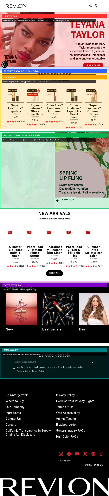
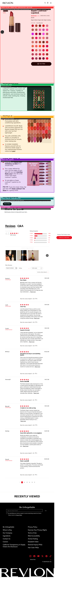
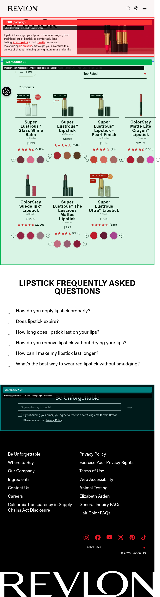
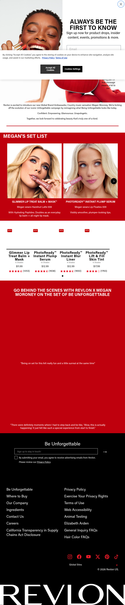

# Block Placement & Authoring Inputs Guide

This document shows where each shared block appears on representative pages, with annotated screenshots highlighting block boundaries and the authoring inputs required for each.

---

## 1. Homepage Template

**Example:** revlon.com

### Blocks (top to bottom):

| # | Block | Color | Authoring Inputs |
|---|---|---|---|
| 1 | **Hero** (Default variant) | Red | Background Image (Desktop), Background Image (Mobile), Headline, Subheadline, CTA Label, CTA Link, Video URL |
| 2 | **Product Card List** (Carousel variant) | Blue | Section Title, Product Image, Product Name, Product Link, Price, Badge, Shade Count |
| 3 | **CTA Banner** | Orange | Banner Image (Desktop), Banner Image (Mobile), Headline, CTA Label, CTA Link |
| 4 | **Product Card List** (Carousel variant) | Green | Section Title, Product Image, Product Name, Product Link, Price, Badge, Shade Count |
| 5 | **Category Tiles** | Purple | Tile Image, Tile Label, Tile Link (repeatable) |
| 6 | **Email Signup** | Teal | Heading, Description, Button Label, Legal Disclaimer |

---

## 2. Product Detail Template

**Example:** revlon.com/products/super-lustrous-lipstick

### Blocks (top to bottom):

| # | Block | Color | Authoring Inputs |
|---|---|---|---|
| 1 | **Product Gallery + Product Info + Shade Selector + Add to Cart** | Red | Product Images, Alt Text, Product Title, Price, Tagline, Description, Shade Name, Shade Number, Shade Swatch Image, Try-On Toggle, Retailer Links |
| 2 | **Product Tabs — Description** | Blue | Details Content (Rich Text) |
| 3 | **Product Tabs — Details** | Green | Key Benefits (Bulleted Rich Text) |
| 4 | **Product Tabs — How to Use** | Orange | How to Use Content (Rich Text with product links) |
| 5 | **Product Tabs — Ingredients** | Purple | Ingredients Content (Rich Text) |
| 6 | **Product Card List — Related** (More to Love) | Teal | Section Title, Product Image, Product Name, Product Link, Price, Shade Count |
| 7 | **Customer Reviews** | Pink | Enable Reviews (Boolean), Review Source (3rd party integration ID) |

---

## 3. Product Collection Template

**Example:** revlon.com/collections/lipstick

### Blocks (top to bottom):

| # | Block | Color | Authoring Inputs |
|---|---|---|---|
| 1 | **Hero** (Category variant) | Red | Title, Description (Rich Text), Banner Image |
| 2 | **Filter + Product Card List** (Grid variant) | Blue | Filter Group Name, Filter Options, Sort Controls, Product Image, Product Name, Product Link, Price, Shade Count, Badge |
| 3 | **FAQ Accordion** | Green | Question (Text, repeatable), Answer (Rich Text, repeatable) |
| 4 | **Email Signup** | Teal | Heading, Description, Button Label, Legal Disclaimer |

---

## 4. Product Line Landing Template

**Example:** lottabody.com/coconut-and-shea-oils/

### Blocks (top to bottom):

| # | Block | Authoring Inputs |
|---|---|---|
| 1 | **Hero** (Product Line variant) | Banner Image (Desktop), Banner Image (Mobile), Line Name, Tagline |
| 2 | **Product Card List** (Card Grid variant) | Product Image, Product Name, Short Description, CTA Label, CTA Link (repeatable per product) |

---

## 5. Landing/Promo Template

**Example:** revlon.com/pages/megan-moroney-x-revlon

### Blocks (top to bottom):

| # | Block | Authoring Inputs |
|---|---|---|
| 1 | **Hero** (Campaign variant) | Hero Image (Desktop), Hero Image (Mobile), Headline, Subheadline, CTA Label, CTA Link |
| 2 | **Pull Quote** | Quote Text, Attribution, Background Image |
| 3 | **Product Card List** (Featured variant) | Section Title, Product Image, Product Name, Product Link, Product Description, Price, Badge |
| 4 | **Pull Quote** (Behind the Scenes) | Quote Text, Attribution |
| 5 | **Email Signup** | Heading, Description, Button Label, Legal Disclaimer |

---

## 6. Blog Article Template

**Example:** revlon.com/blogs/makeup/spring-makeup-looks

### Blocks (top to bottom):

| # | Block | Authoring Inputs |
|---|---|---|
| 1 | **Hero** (Blog variant) | Featured Image, Title, Publication Date, Author |
| 2 | **Article Body** (default content) | Rich text with headings, paragraphs, inline images, links |
| 3 | **Product Callout** (inline) | Product Image, Product Name, Product Link, Short Description |
| 4 | **Social Share** | Facebook Share (Boolean), Twitter Share (Boolean), Pinterest Share (Boolean) |
| 5 | **Product Card List** (Related variant) | Section Title, Related Article Image, Title, Link |

---

## 7. Where to Buy Template

**Example:** lottabody.com/where-to-buy/

### Blocks (top to bottom):

| # | Block | Authoring Inputs |
|---|---|---|
| 1 | **Retailer Grid** | Retailer Logo (Image), Retailer Name, Retailer Link, Availability Type (repeatable per retailer) |
| 2 | **Store Locator** | Retailer List, Search Label, Button Label |

---

## 8. FAQ Template

**Example:** revlon.com/pages/general-faq

### Blocks (top to bottom):

| # | Block | Authoring Inputs |
|---|---|---|
| 1 | **FAQ Accordion** | Category/Section Label (optional), Question (Text, repeatable), Answer (Rich Text, repeatable) |

---

## 9. Contact Template

**Example:** lottabody.com/contact/

### Blocks (top to bottom):

| # | Block | Authoring Inputs |
|---|---|---|
| 1 | **Form** (Contact variant) | Form Title, Form Description, Field Labels (Name/Email/Subject/Message), Submit Button Label, Success Message |

---

## 10. Quiz/Interactive Template

**Example:** revlon.com/pages/lip-combo-quiz

### Blocks (top to bottom):

| # | Block | Authoring Inputs |
|---|---|---|
| 1 | **Quiz Container** | Quiz Title, Introduction Text, Question Text (repeatable), Answer Option Label (repeatable), Answer Option Image, Result Category Name, Result Description, Result Product Image, Result Product Name, Result Product Link, Result Product Price |

---

## Color Legend (for annotated screenshots)

| Color | Meaning |
|---|---|
| Red | Hero / primary above-the-fold block |
| Blue | Product listing / carousel / grid |
| Orange | CTA Banner / promotional content |
| Green | Secondary content (tabs, FAQ, new arrivals) |
| Purple | Category tiles / ingredients / supplemental |
| Teal | Email signup / newsletter |
| Pink | Reviews / social |

---

## Related Files

- [`page-template-mapping.csv`](page-template-mapping.csv) — Every URL mapped to its template
- [`template-block-mapping.csv`](template-block-mapping.csv) — Which blocks appear on which templates
- [`block-authoring-inputs.csv`](block-authoring-inputs.csv) — Detailed field-by-field authoring inputs (original)
- [`block-authoring-inputs-consolidated.csv`](block-authoring-inputs-consolidated.csv) — Shared blocks with variants
