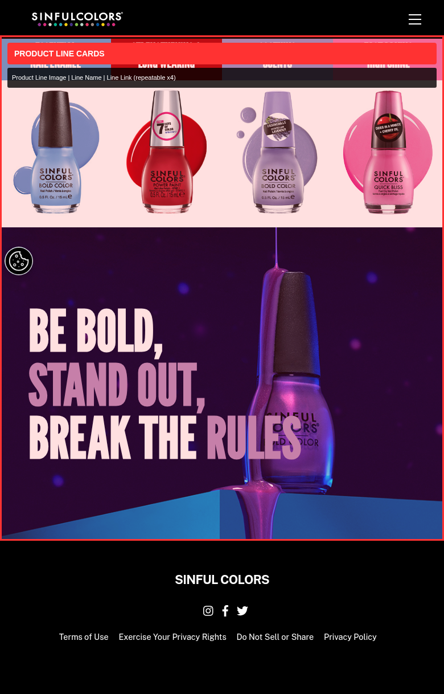
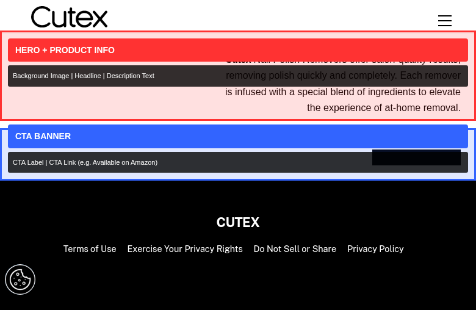
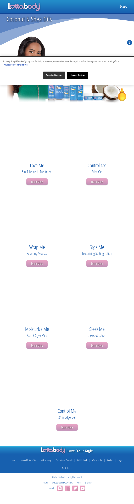

# Block Placement & Authoring Inputs Guide

This document shows where each block appears on representative pages across 4 brands (Lottabody, Roux Beauty, Cutex, Sinful Colors), with annotated screenshots and authoring inputs.

---

## 1. Homepage — Sinful Colors

**URL:** sinfulcolors.com

### Blocks:

| # | Block | Color | Authoring Inputs |
|---|---|---|---|
| 1 | **Product Line Cards** | Red | Product Line Image, Line Name, Line Link (repeatable x4: Bold Color, Power Paint, Essenchills, Quick Bliss) |

---

## 2. Homepage — Cutex

**URL:** cutex.com

### Blocks:

| # | Block | Color | Authoring Inputs |
|---|---|---|---|
| 1 | **Hero + Product Info** | Red | Background Image (Desktop/Mobile), Headline, Description Text |
| 2 | **CTA Banner** | Blue | CTA Label, CTA Link (e.g. "Available on Amazon") |

---

## 3. Homepage — Lottabody

**URL:** lottabody.com

The Lottabody homepage features a video hero, product line showcases, and email signup.

### Blocks (top to bottom):

| # | Block | Authoring Inputs |
|---|---|---|
| 1 | **Hero** (with Video) | Video URL (YouTube embed), Background Image (fallback) |
| 2 | **Product Line Cards** | Product Line Image, Line Name, Line Link (x2: Milk & Honey, Coconut & Shea Oils) |
| 3 | **CTA Banner** | Banner Image, CTA Label, CTA Link (product-specific CTAs) |
| 4 | **Newsletter Signup** | Heading, Description, Button Label |

---

## 4. Product Line Landing — Lottabody

**URL:** lottabody.com/coconut-and-shea-oils/

### Blocks (top to bottom):

| # | Block | Authoring Inputs |
|---|---|---|
| 1 | **Hero (Product Line)** | Banner Image, Line Name (e.g. "Coconut & Shea Oils"), Collection Image |
| 2 | **Product Card Grid** | Product Image, Product Name, Subtitle, CTA Label ("Learn More"), CTA Link (repeatable x7 products) |

---

## 5. Product Detail — Cutex

**URL:** cutex.com/product/ultra-powerful/

### Blocks (top to bottom):

| # | Block | Authoring Inputs |
|---|---|---|
| 1 | **Product Image** | Product Image, Alt Text |
| 2 | **Product Info** | Product Title, Short Description, Key Features (bullet list), Size/Volume, SKU, Category, Tags |
| 3 | **Product Tabs** | Details Content, Ingredients Content, How to Use Content |

---

## 6. Product Detail — Roux Beauty

**URL:** rouxbeauty.com/hair-color/fanci-full-rinse/

### Blocks (top to bottom):

| # | Block | Authoring Inputs |
|---|---|---|
| 1 | **Product Image** | Product Image, Alt Text |
| 2 | **Product Info** | Product Title, Price, Short Description, Key Features (bullets), "The No's" (excluded ingredients) |
| 3 | **Product Tabs** | Details Content, Ingredients Content (per shade), How to Use Content |
| 4 | **Customer Reviews** | Enable Reviews (Boolean), Review Form Fields (Name, Email, Title, Rating, Review text) |
| 5 | **Store Finder CTA** | Button Label ("Find a Store"), Button Link |

---

## 7. Product Detail — Sinful Colors

**URL:** sinfulcolors.com/product/black-on-black/

### Blocks (top to bottom):

| # | Block | Authoring Inputs |
|---|---|---|
| 1 | **Product Image** | Product Image (2 angles), Alt Text |
| 2 | **Product Info** | Product Title, Description, Key Features (5 bullets), Directions, SKU, Category Tags |
| 3 | **Certifications Block** | Certification claims (cruelty-free, vegan, "without 17 harmful ingredients") |

---

## 8. Product Collection — Cutex

**URL:** cutex.com/store/products/acetone-removers/

### Blocks (top to bottom):

| # | Block | Authoring Inputs |
|---|---|---|
| 1 | **Category Header** | Category Title (auto from breadcrumb), Breadcrumb path |
| 2 | **Product Grid** | Product Image, Product Name, Product Link (repeatable — shows all products in category) |

---

## 9. Product Collection — Sinful Colors

**URL:** sinfulcolors.com/nail-polish/bold-color/

### Blocks (top to bottom):

| # | Block | Authoring Inputs |
|---|---|---|
| 1 | **Category Header** | Category Title (e.g. "BOLD COLOR"), Results count |
| 2 | **Product Grid** | Product Image, Product Name, Product Link (repeatable — paginated with Load More) |

---

## 10. Blog Article (Study Material) — Lottabody

**URL:** lottabody.com/study-material/lottabody-milk-honey-natural-hair/

### Blocks (top to bottom):

| # | Block | Authoring Inputs |
|---|---|---|
| 1 | **Article Hero** | Title, Featured Image (product line image) |
| 2 | **Product Education Cards** | Product Image, Product Name, Benefits List, "The No's", Usage Instructions, Learn More Link (repeatable per product — carousel/sequential format) |

---

## 11. Where to Buy — Lottabody

**URL:** lottabody.com/where-to-buy/

### Blocks (top to bottom):

| # | Block | Authoring Inputs |
|---|---|---|
| 1 | **Retailer Grid** (Primary) | Retailer Logo, Retailer Name, Retailer Link (x5: Sally Beauty, Walmart, Dollar General, Naturally Curly, Amazon) |
| 2 | **Retailer Grid** (Secondary) | Retailer Logo, Retailer Name (x3: Walgreens, Family Dollar, Fred's) — no purchase links |
| 3 | **Availability Note** | Text noting "Also available at beauty and barber supply stores nationwide" |

---

## 12. Gallery — Lottabody

**URL:** lottabody.com/style-gallery/

### Blocks (top to bottom):

| # | Block | Authoring Inputs |
|---|---|---|
| 1 | **Gallery CTA** | Instructional text ("Click on images to learn more!") |
| 2 | **Image Gallery** | Gallery Image (repeatable x19+), Image Caption, Click Action Link |

---

## 13. Contact — All Brands

**URL:** lottabody.com/contact/ | rouxbeauty.com/contact-us/ | cutex.com/contact-us/ | sinfulcolors.com/contact-us/

### Blocks:

| # | Block | Authoring Inputs |
|---|---|---|
| 1 | **Contact Form** | Form Title, Form Description, Field Labels (Name / Email / Subject / Message), Submit Button Label, Success Message |

---

## 14. Legal/Policy — All Brands

**URL:** */privacy/ | */terms/ | */dsar/

### Blocks:

| # | Block | Authoring Inputs |
|---|---|---|
| 1 | **Text Content** (default — no custom block) | Headings, paragraphs, lists (standard rich text) |
| 2 | **Privacy Form** (DSAR pages only) | Form Title, Form Description, Submit Button Label |

---

## 15. About — Sinful Colors / Cutex / Roux

**URL:** sinfulcolors.com/about-us/ | cutex.com/about-us/ | rouxbeauty.com/about-roux/

### Blocks:

| # | Block | Authoring Inputs |
|---|---|---|
| 1 | **Brand Story** (default content — no custom block) | Rich text narrative (headings, paragraphs, brand history) |
| 2 | **Certifications Block** | Certification Type, Description, Excluded Ingredients List |

---

## 16. Monthly Specials — Roux Beauty

**URL:** rouxbeauty.com/specials/january/ (through /december/)

### Blocks:

| # | Block | Authoring Inputs |
|---|---|---|
| 1 | **Specials Header** (default — no custom block) | Month title text |
| 2 | **Promo Content** | Featured Image, Headline, Body Text, CTA Label, CTA Link, Product References |

---

## Color Legend (annotated screenshots)

| Color | Block Type |
|---|---|
| Red | Hero / primary visual content |
| Blue | CTA / product grid / secondary content |
| Green | Supplementary content (tabs, FAQ) |
| Purple | Metadata / ingredients |
| Teal | Email signup / forms |

---

## Related Files

| File | Description |
|---|---|
| [`page-template-mapping.csv`](page-template-mapping.csv) | Every URL mapped to its template (163 URLs, 4 brands) |
| [`template-block-mapping.csv`](template-block-mapping.csv) | Which blocks appear on which templates (21 custom blocks) |
| [`block-authoring-inputs-consolidated.csv`](block-authoring-inputs-consolidated.csv) | Shared blocks with variants and field-by-field authoring inputs |

---

## Summary Statistics

| Metric | Value |
|---|---|
| Total URLs | 163 |
| Brands | 4 (Lottabody, Roux Beauty, Cutex, Sinful Colors) |
| Templates Identified | 13 |
| Custom Blocks Required | 21 |
| Shared Block Implementations | 14 (with variants) |
| Total Authoring Fields | 87 |
